# Spatial_transcriptomics
## 1 概括
### 10X空间转录组技术发展
2018年，10X Genomics收购了总部位于瑞典斯德哥尔摩的spatial Transcriptomics公司。其现有产品的革命性的工作流程使用了两种带有专利涂层的载玻片。每张基因表达载玻片可以容纳4个单独的组织切片，通过带有位置信息的barcode从而获得空间层面（二维）分辨率的RNA测序数据。
2016, Science, Spatial transcriptomics (ST)技术，捕获区域上有1007个孔，每个孔中包含有约200万个寡核苷酸，每个孔的直径是100um，孔与孔圆心的距离是200um，捕获区域的面积是6.2mmx6.6mm。
2019年底，10XGenomics对ST技术进行了更新升级，推出了Visium空间基因表达解决方案--10X空间转录组技术。
一张载玻片有4个区域，每个区域上有5000个spots，每个spot的直径是55um，相邻spot圆心的距离是100um，每个spot中细胞数目1-10个，捕获区域的面积是6.6mmX6.5mm。

**两种试剂盒**

组织优化试剂盒和基因表达试剂盒
- Visium Spatial Tissue Optimization slide and Reagent Kit
  - 4 sample TO kit (4 slides)
  - Four new tissues can be optimized per TO kit(one new tissue per slide)
  - No spatial barcodes
- Visium Spatial Gene Expression Slide and Reagent Kit
  - 4 reactions (1 slide) and 16 reactions (4 slides) LP kit
  - Each slide has 4 capture areas containing spatial barcodes

**组织优化试剂盒工作原理**
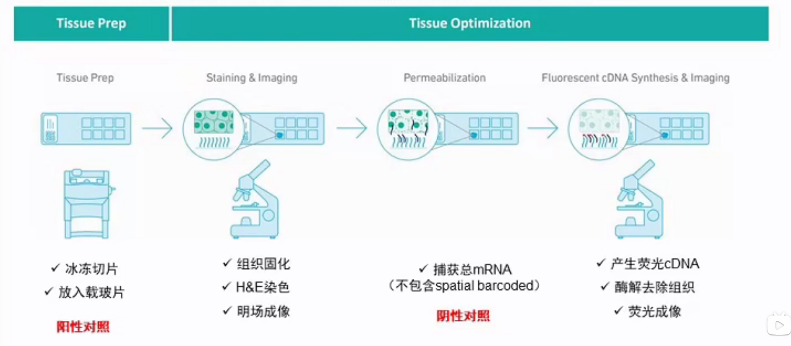

如何判断最优透化时间：
1. 确保切片厚度一致
2. 荧光信号亮度，弥散信号
3. 根据组织形态学（主观）
4. 根据后续基因表达实验中每个spot中UMI的count数；
大部分组织：3～30min
RNA含量越丰富的组织，所需要的透化时间越长。

**官方已测试组织类型**
https://support.10xgenomics.com/spatial-gene-expression/tissue-optimization/doc/specifications-visium-spatial-gene-expression-optimized-tissues

**基因表达试剂盒工作原理**
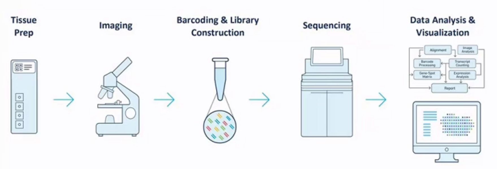
空间基因表达芯片（LP芯片）包含4个捕获区域（6.5mmx6.5mm），每个区域含有5000个spots，每个spot均含唯一的sptatial barcode和上百万个核苷酸引物，每个spot直径为55um，两个spots中心点间隔100um。对切片进行透化后，细胞释放的mRNA可与带有barcode的引物结合，后续合成cDNA并进行文库的构建。
依据组织类型不同，每个barcode可对应1～10个细胞（并不是单细胞解决方案）。红色边框的基准点处无oligo序列，其用于将测序数据和图像数据进行整合。
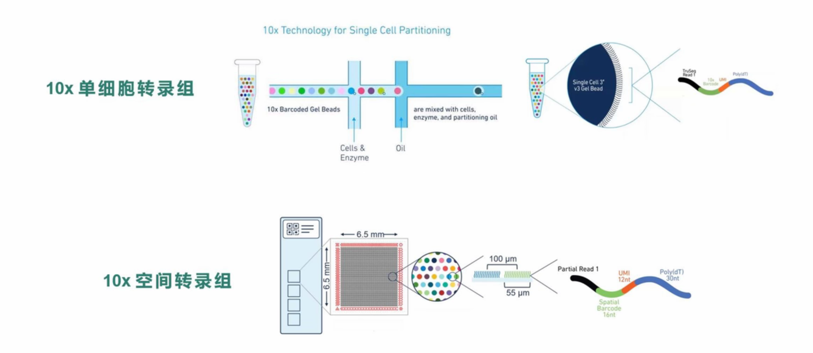
单细胞测序是用胶珠和油包水的方法把细胞分开，同时又用barcode保留单细胞信息。Visium空间转录组则是把切片在芯片上展开，在空间上用条形码来保留切片上每个小点的空间位置信息。空间转录组，在操作上是先把切片固定到芯片上，并用H&E染色之后，就可以在显微镜下看到这样的图。
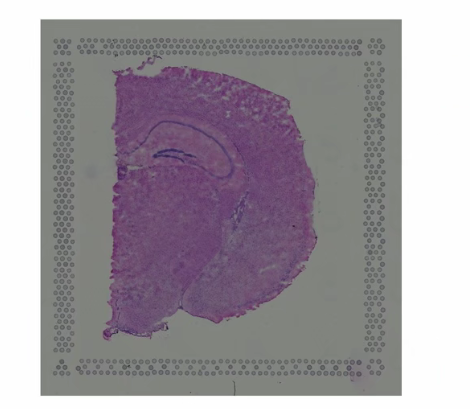
这里是一个成年小鼠脑部的切片，芯片四周会做许多个小点，这些点是用来在空间上给切片定位用的。

**测序**
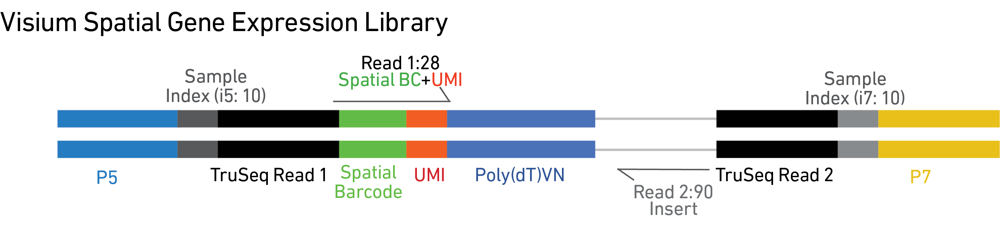
https://support.10xgenomics.com/spatial-gene-expression/sequencing/doc/specifications-sequencing-requirements-for-visium-spatial-gene-expression
Minimum Sequencing Depth: We recommend a minimum of 50k read pairs per spot covered with tissue. To calculate this, first estimate the % of capture area covered by the tissue section based upon the H&E brightfield image. Then use the following formula to calculate the recommended sequencing depth:

• Total sequencing depth = (Coverage Area x total spots on the Capture Area) x 50,000 read pairs/spot

Example calculation for 60% tissue coverage: (0.60 x 5,000 total spots) x 50,000 read pairs/spot = 150 million total read pairs for that sample

Additional guidelines for estimating the number of spots covered: Determining number of spots covered with tissue may be performed visually or by using the Visium Manual Alignment Wizard in Loupe Browser for a more accurate measurement.

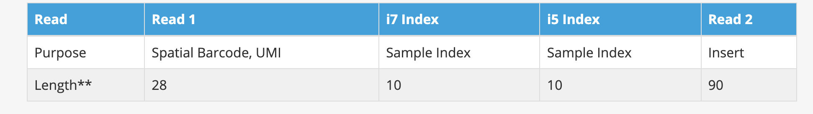
** Shorter reads than indicated above can lead to decreased application performance. Sample index reads must not be shorter than indicated. Any read can be longer than recommended. Additional bases in Sample index reads must be trimmed using SpaceRanger mkfastq or Illumina's bcl2fastq prior to further analysis.

数量官方建议：单个spot大于等于50K PE reads，根据组织切片所占spot区域的面积进行估算。
测序深度=（%覆盖面积X5000）X50000 PE reads
250-300 M PE reads

## 2 10X空间转录组数据分析
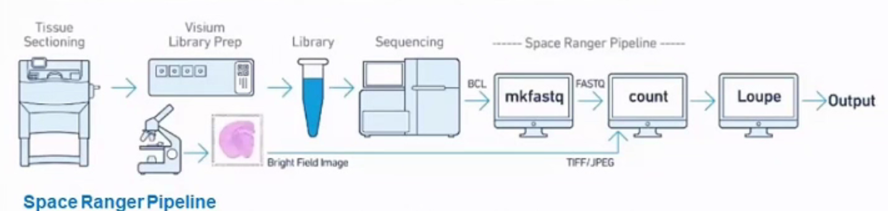

spaceranger mkfastq: 打包了bcl2fastq，将下机芯片的bcl数据转换成fastq数据
spaceranger count: image和fastq作为输入，进行比对（STAR）、表达量，图像与表达数据整合分析等。https://support.10xgenomics.com/spatial-gene-expression/software/pipelines/latest/what-is-space-ranger

Loupe Browser
本地交互式分析软件，spaceranger count 产生的 .cloupe文件作为输入进行可视化展示，可进行基因筛选、聚类展示，差异表达分析。https://support.10xgenomics.com/spatial-gene-expression/software/visualization/latest/what-is-loupe-browser

**分析流程开发**
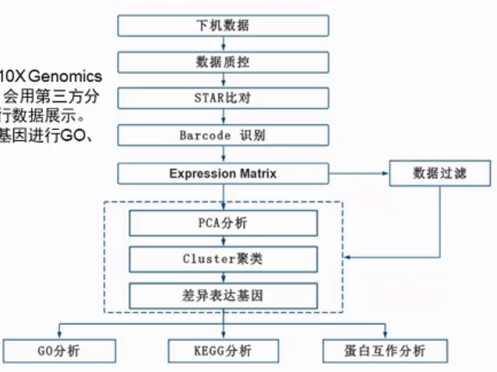
注：虚线框部分将进行两次分析，除10XGenomics官网软件Space Ranger分析之外，会用第三方分析工具Seurat再进行分析，然后进行数据展示。并且对Seurat分析得到的差异表达基因进行GO、KEGG和蛋白互作网络功能分析。

**SpaceRanger**
```shell
spaceranger count \ 
--id=ID \ #结果输出路径，样本名称
--fastqs=PATH \ #fastq文件路径
--sample=sample1 \ #fastq文件名前缀，样本名称
--transcriptome=DIR \ #refdata-cellranger， 参考基因组路径，可以在官网下载已有的物种
--image=IMG \ #HE染色图片，tif或jpg
--slide=SLIDE \ #载玻片序列号 ｜ --unknown slide #载玻片序列号未知的情况
--area=AREA \ #铺货区域，如A1
--localmem=INT \ #内存数，例如64
--localcores=INT \ #线程数，例如8
```
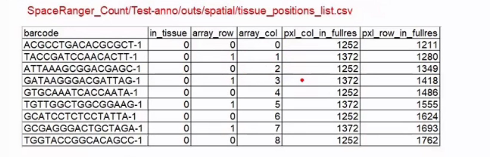
barcode: barcode信息
in_tissue: ‘1’代表该spot被组织切片覆盖，‘0’代表该spot未被组织切片覆盖
array_row: spot在捕获区域中位于第几行，横坐标，共78行。
array_col: spot在捕获区域中位于第几列，纵坐标，偶数0-126，奇数1-127，共64个
pxl_col_in_fullres:图像中spot中心位置的列像素坐标
pxl_row_in_fullres:图像中spot中心位置的行像素坐标


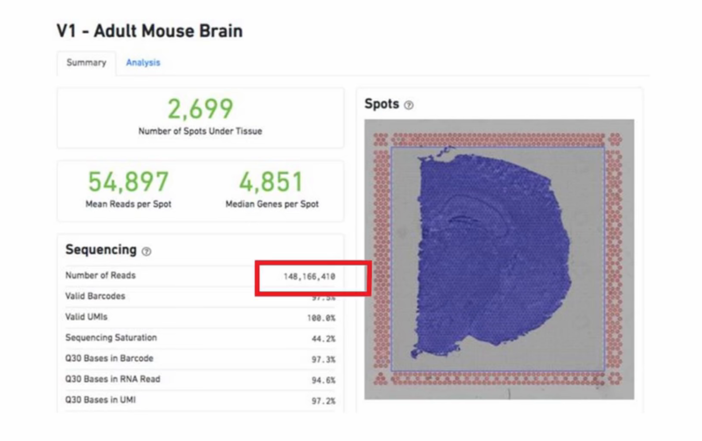
我们经过对这个样本的测序，得到的初步结果就是有1.4亿多条的reads， 2699个spot上是有测到序列，每个spot上有表达的基因数量的中值是4851个基因
## 聚类分析
几千个spot，每个spot有几千个甚至上万个基因的表达量，这远远超出了普通人能够理解或者想象的范围
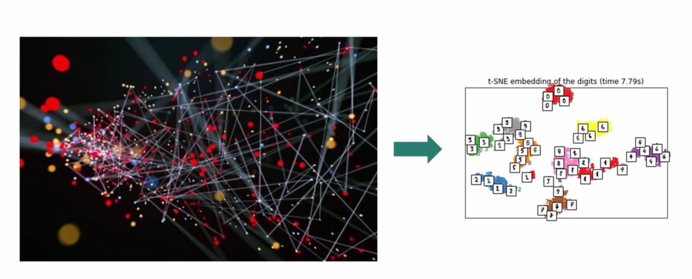
通过降维，大量信息变成两维的，或低纬的信息，以便于在荧幕上或者纸面上进行展示。几千个spots通过聚类被划分成几个或者十几，二十几个的cluster，方便人脑识别，也方便进行接下来的分析。
PCA方法对表达数据进行主成分分析。简单来说，PCA就是一个算法，他能在千万变量中，找到主要矛盾，经过PCA降维分析之后，把第一个主成分，也就是PC_1，和第二个主成分，也就是PC_2，做成一个二维图
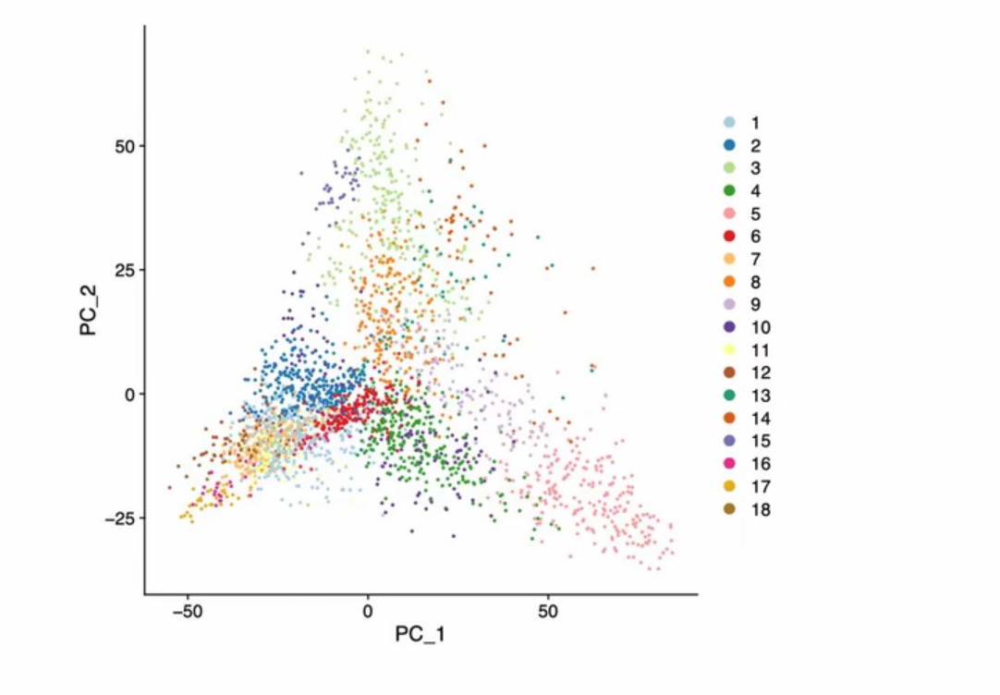
接下来去PCA当中的前30个主要成份，用Seurat软件中的Graph Base Louvain Cluster方法进行聚类分析，再用t-SNE降维并进行展示。t-distributed, stochastic neighbor embedding. t-SNE的一个优点，就是能把聚类的点在显示的时候聚合在一起进行展示。在这张图当中，我们可以看到有相似的点被聚集在一起，算法把它们分成了18个簇cluster。在图中这18个簇用18种颜色标了出来，图中的右侧的图例是簇的编号与簇的颜色的对应关系。
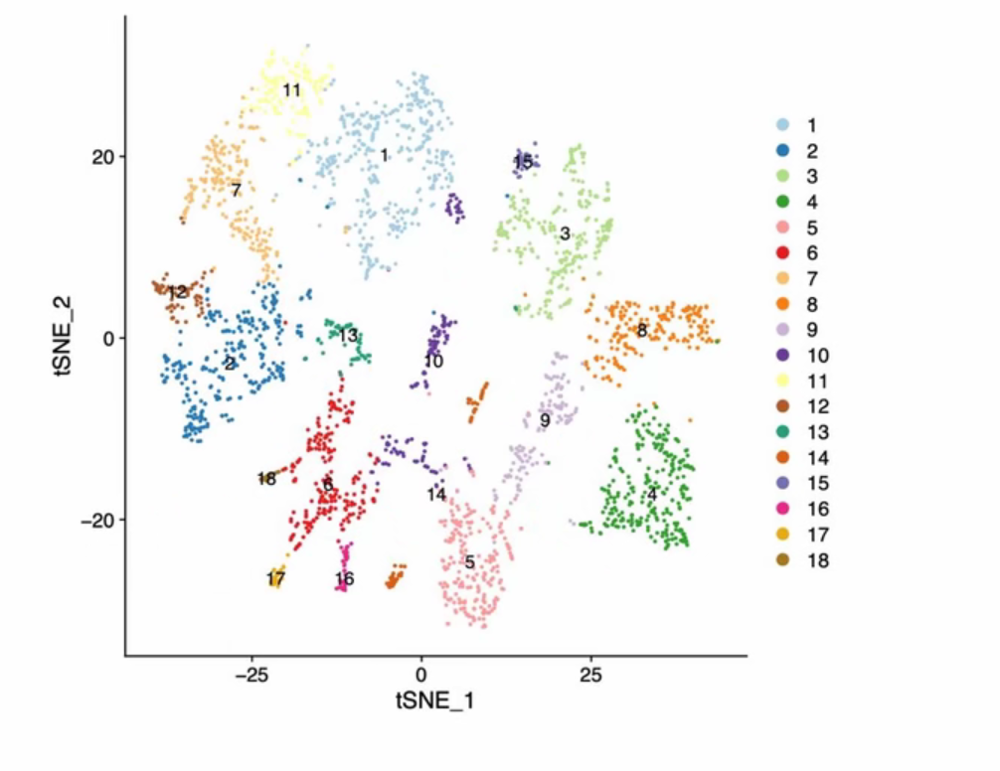
接着我们还可以做UMAP图，Uniform Manifold Approximation and Projection. UMAP除了把spot以聚类的方式表现出来之外，他还可以表现出细胞分化的轨迹。也就是说，如果两个簇的细胞是从同一个来源分化出来的，那么UMAP就会把它们放到相近的位置。这有利于发现细胞分化树的信息。
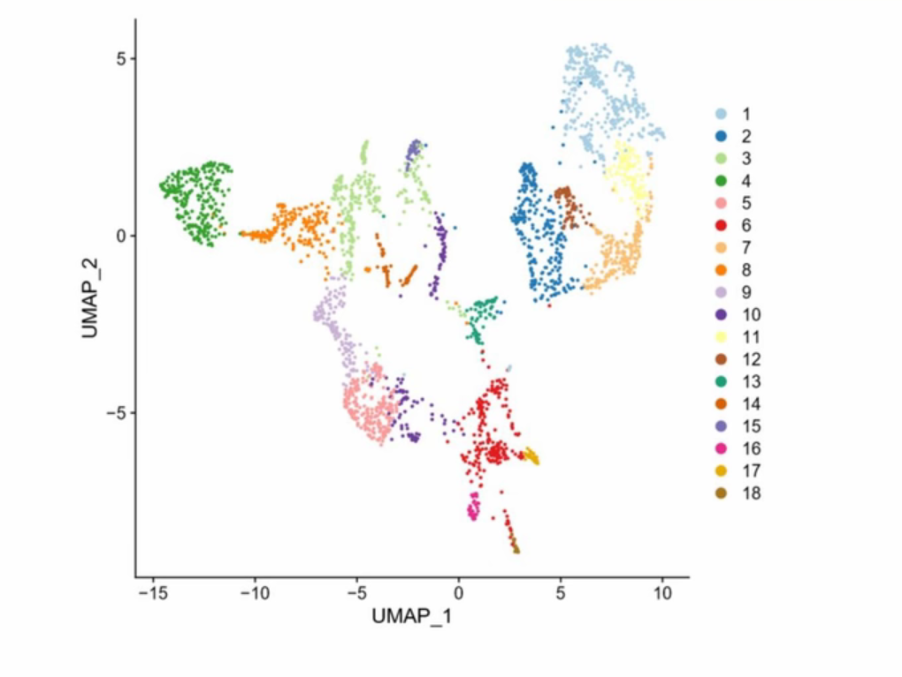
有了t-SNE和UMAP图之后，我们就可以直接对每个spot的基因表达量做分布图。这个是nFeature_Spatial图，首先它是基于t-SNE图的，用来表示一个spot中有多少个基因的表达被检测到。表达的基因数越多，则颜色越红。因为一般而言，一个细胞当中能表达的基因数量越多，往往表示这个细胞的分化程度越低，而一个细胞当中能表达的基因数量越少，则这个细胞的分化程度越高。大家可以有一些联想，就是红色的spot可能其中的细胞的分化程度低，灰色的spot可能其中的细胞的分化程度高。但是这个不一定的，因为每个spot当中有多少个细胞是不确定的。

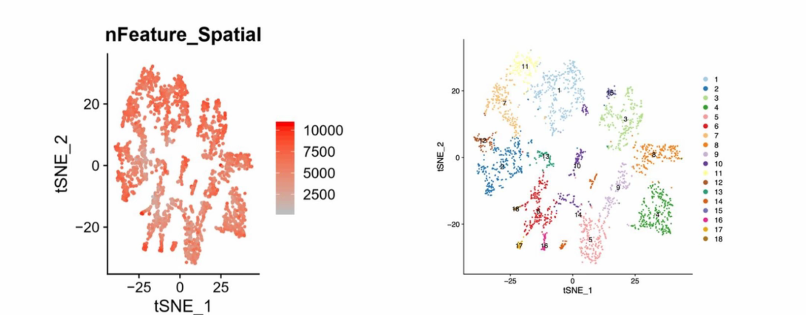

这个是nCount_Spatial图，逻辑是一样的，只是把有多少个基因被检测到，换成多少条UMI被检测到，而每一条umi都关联到一条原始的mRNA，所以nCount的这张图，也可以理解成对spot当中的mRNA的多少进行描述的一张图。
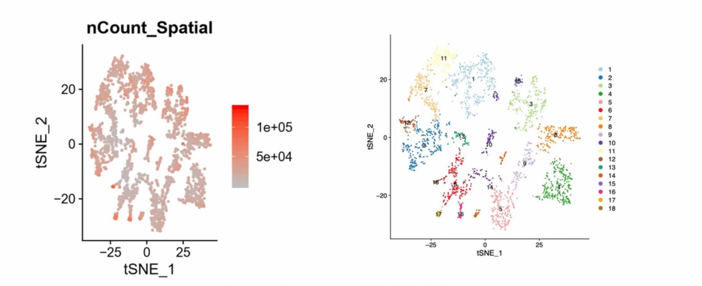
然后我们可以通过10X公司的Loupe Browser软件，轻松地把这些归纳成簇的spot还原到切片的空间位置上。这样，cluster和切片的关系，就用很直观的方式呈现在大家面前了。
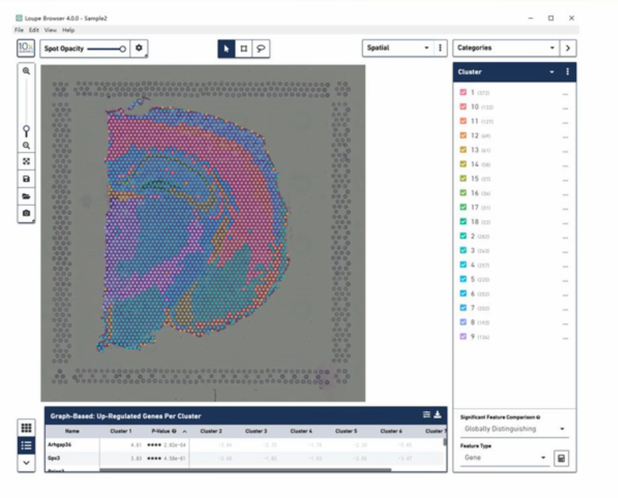
## 差异表达
**Spot 群相关性热图**
这是把所有的簇进行两两比较的图，也就是一个矩阵，图中红颜色是两个cluster相似性很高，蓝颜色则表示相似性很低。在这个矩阵当中可以直观地看到各个cluster的两两相似性。
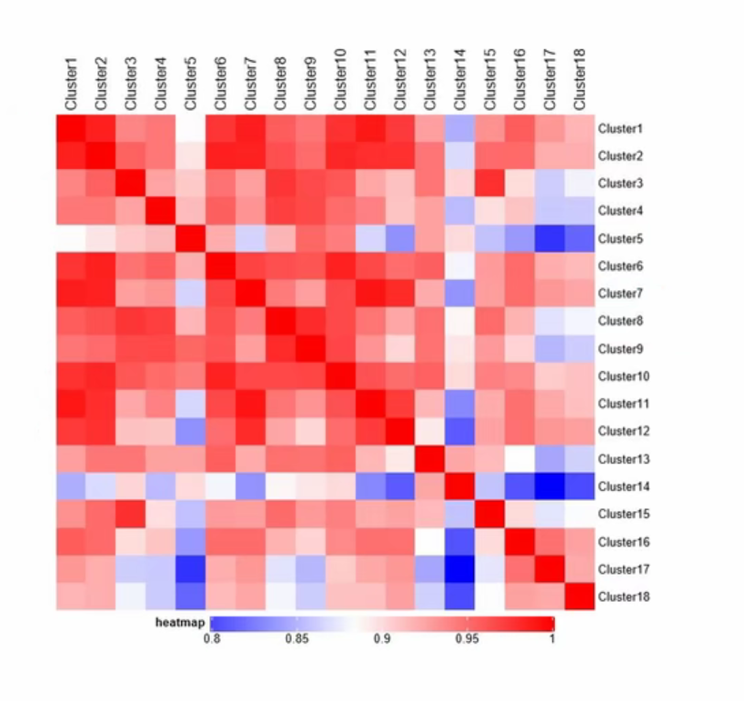
**簇的PCA图**
PCA图以更加直观的方法，让大家可以直观地从整体上看到各个cluster之间的相互距离和相互差异
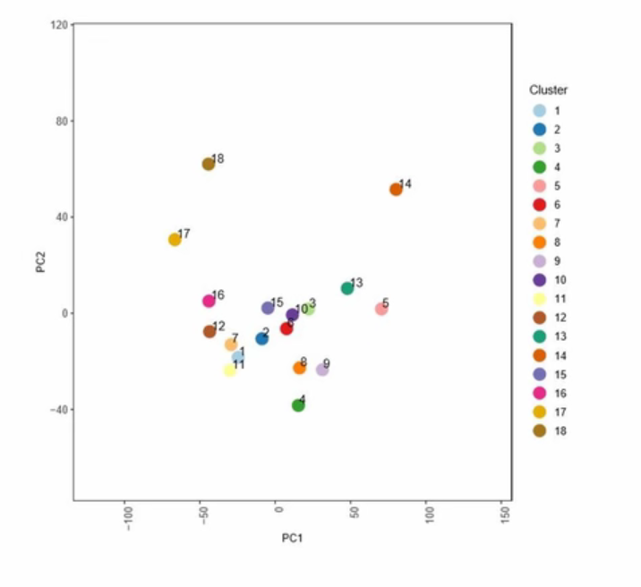
**Spot群特异表达基因的热图**
群特异表达基因的热图，横轴是按簇被组织起来的spot，每一条细的纵列，就是一个spot，每一块纵向的块，就是一个簇，纵轴上是一个一个的基因。在第一个cluster当中高表达的那些基因被聚集起来放在最上面。接下来排第二个cluster当中高表达的基因，这样依次排下去。黄颜色表示高表达，紫颜色表示高表达，有了这样一张热图，一个簇里面有那些基因是高表达的，就一目了然了。
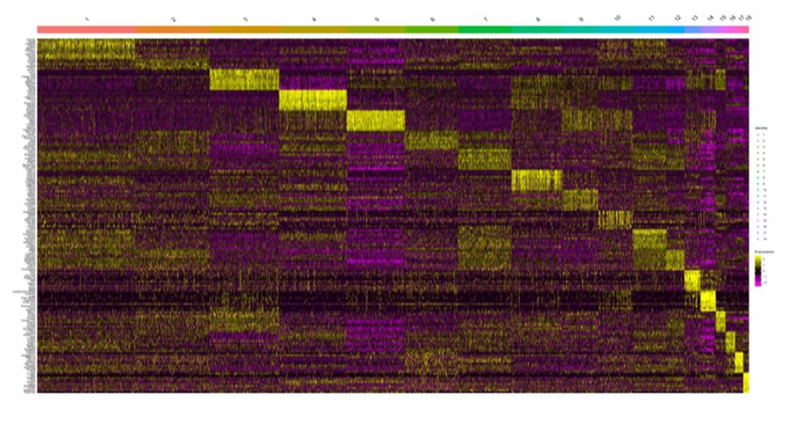

**Spot群特异表达基因的热图的一角**
我们把左上角展开来，也就把它的第一个簇中，表达量最高的那些基因显示出来，我们看到，这里排在第一位的基因是Efhd2，我查了一下，这个基因可能是与老年痴呆症有相关的。

**簇表达基因的点图**
接下来的这张图，还是簇和基因表达量的关系，每一个点就是一个基因和一个簇的交叉关系。但这张图更加关注簇，而不是关心spot，最小一个纵列是一个簇。同时，这张图中的每个点上有两个新纬度。一个是点的大小，代表该簇当中该基因的umi大于零的spot的数量，也就是该簇当中有几个spot表达了这个基因。第二是点的颜色，它表示该簇当中平均每个spot表达该基因的平均表达量，越红则平均表达量越高。
**簇表达基因的点图左下角**
我们把这张图的最左下角展开来，还是第一簇当中表达最高的那些基因，第一个基因还是Efhd2.既然Efhd2是这么一个很有特点的基因，那我们接下来还会反复追踪这个基因，用来给大家做展示。
**Efhd2在t-SNE图中**
这是在所有的spot当中的Efhd2这个基因的表达量放在t-SNE的当中，让大家来看。这是之前的按簇划分的t-SNE图，这当中1号簇是位于上面中间的浅蓝色的这些点。我们在这里可以清楚地看到，Efhd2这个基因就是在上面中间的这些点里面颜色最红，表达量最高。
**各个基因表达量的小提琴图**
接下来，我们来看各个基因的小提琴图。这里的小提琴图表现的是一个基因在各个簇里的表达情况。横轴上是18个cluster纵轴是一个spot当中该基因的表达量，越高则表示表达量越大。小提琴的宽度是指在这个表达水平，有多少个spot。从图中我们可以Efhd2这个基因的表达量，在第一个簇里是最高的。而且第一簇里大多数的细胞Efhd2表达量集中在略超过2的水平。把Efhd2这个基因的表达还原到spot的原来空间位置。我们可以看到，最红的点，也就是Efhd2表达量最高的spot都集中在这一个弧线上。再来和第一个簇中的spot在切片当中的分布情况对照一下。很明显，Efhd2这个基因的高表达的空间位置，就是和第一个簇的空间位置高度重合的。
这样，我们就把差异表达的集中图示方法给大家介绍了一边

## 结合数据库
**结合GO数据库分析**
细胞组件 （Cellular Component, CC）
分子功能 （Molecular Function，MF）
生物过程 （Biological Process， BP）
把各个cluster当中有明显高表达的基因映射到这三棵树上去，然后看有那些节点是有明显的富集的。
把第一个簇映射到三棵树上之后，把每棵树上富集度最高的10个节点列出来。高表达基因在树上的精细结构当中的富集情况。越上面的节点包含的内容越宽泛，越是下面的节点包含的内容就越是特定，范围越精细。如果热点基因在一个节点当中的富集程度越高，则这个节点的颜色就越红，反之，如果富集程度低，则节点的颜色就越淡。
显著富集散点图，对有富集的节点进行更细化的展示。通过这张图，我们可以看到：基因数，富集因子，P值，这三个值。基因数用园点的面积大小来表示，圆点的面积越大，则这个点当中有表达的基因越多。富集因子rich factor用横轴来表示，越靠近右边，则富集程度越高。rich factor是指这里的基因数量，与平均基因数量的比值。P值则用颜色来表示，P值越显著，圆点的颜色越偏红。
基因比例图，比例当中的分子是这个节点有表达的基因数，分母是这次分析中找到的全部基因数，以百分比的方式，在横轴上显示出来。
显著富集go节点与候选基因网络图，在这张图当中，中心的圆点是一些GO的节点，这是根据节点P值的显著性，挑出的前20个节点。节点的圆面积，表示这个节点当中包含的基因数量。外面分出去的点，是一个一个的基因。也就是说，网络中有那些节点，有那些基因，其实早就存在于一个完整的GO节点与基因的网络图中。用富集的方法，把实验样本最相关的一些节点和一些基因给高亮出来。使读者注意到在这个样品中，这些节点或者基因可能会带有特殊的意义，可以进行进一步的研究。
GO节点关系图，这里列出了P值最显著的20个节点，每个节点当中包含的基因越多，则这个节点的圆点就越大。P值越显著，则点的颜色越偏红。这张图更强调节点和节点之间的关系，逻辑是和前面的图一样的。

**KEGG通路富集图**

**富集基因与疾病的关系**
数据库是DisGeNET
显著富集疾病与候选基因的网络图
**目标基因蛋白相互作用网络图**
STRING
## 结合10X单细胞
与10X数据结合分析意义
做这个分析，目的在于搞清楚空间转录组当中一个spot当中最可能是什么种类的细胞，或者说占大头的是那一类细胞。
要做这项工作，首先要对目标样本邻近的组织做一个10X的单细胞测序。但单细胞测序完了之后，再做PCA分析，然后把分析结果与经验数据进行比较，以判定组织中有那些种类的细胞。接下来，再把一个spot中的mRNA数据和用10X方法判断出来的细胞种类，表达值进行比较，找出这个spot中大部分细胞最有可能是那种细胞。
**一个spot中主要是什么细胞**
一个村里80%的人姓王，我们就称这个村为“王村”。而旁边的另一个村姓李的人最多，我们就叫那个村为“李村”。类似的，一个spot里面大多数的细胞可能是内皮细胞，那我们就把这个spot标成“内皮细胞”spot，这张就是内皮细胞spot的空间图。
## 总结
**整体思路**
空间转录组，目前的分析思路就是：现对spot进行降维，聚类分析，得到聚类好的cluster，找出mRNA表达差异，结合已有的数据库，对差异高表达进行进一步分析。找到功能，细胞内定位，通路，蛋白，疾病的各种显著性差异，以及各种高富集性，高关联性。与10X数据结合，把spot还原到细胞种类，通过以上方法得到新的科研线索，这就是目前的分析思路。
