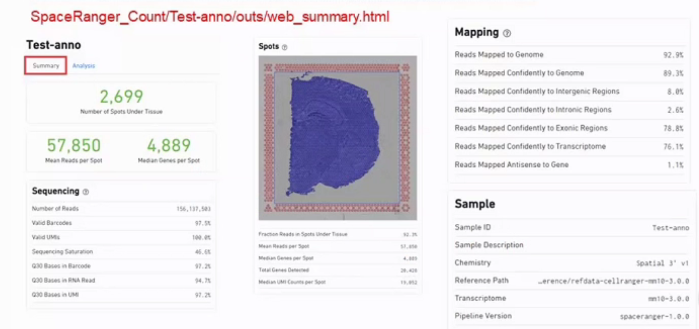

# Spatial_transcriptomics
## 概括

单细胞测序是用胶珠和油包水的方法把细胞分开，同时又用barcode保留单细胞信息。Visium空间转录组则是把切片在芯片上展开，在空间上用条形码来保留切片上每个小点的空间位置信息。空间转录组，在操作上是先把切片固定到芯片上，并用H&E染色之后，就可以在显微镜下看到这样的图。

这里是一个成年小鼠脑部的切片，芯片四周会做许多个小点，这些点是用来在空间上给切片定位用的。

## 聚类分析
## 差异表达
## 结合数据库
## 结合10X单细胞